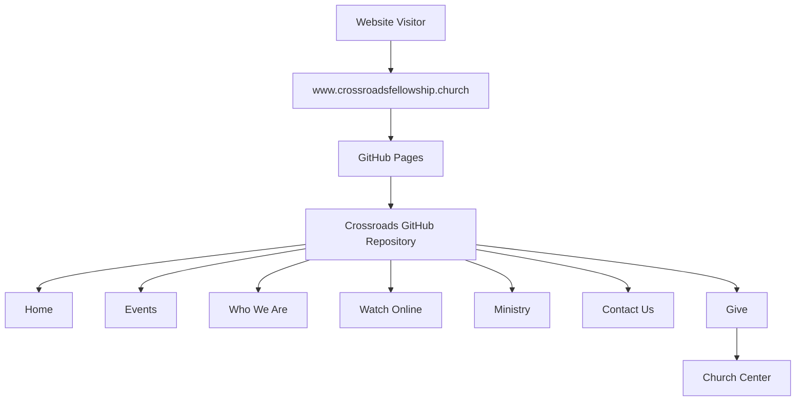

# ✝️ Crossroads Fellowship Church Website

**Crossroads Fellowship** is the official website for Crossroads Fellowship Church in Bixby, Oklahoma.

The website provides visitors with information about the church, worship services, ministries, events, sermons, contact information, and online giving.

🌐 **Live Website:** https://www.crossroadsfellowship.church/

---

## 📍 Church Information

| Item           | Information                                                   |
| -------------- | ------------------------------------------------------------- |
| Church         | Crossroads Fellowship                                         |
| Address        | 100 W Dawes Ave, Bixby, Oklahoma 74008                        |
| Sunday Service | 10:00 AM                                                      |
| Email          | [CrossroadsBixby@gmail.com](mailto:CrossroadsBixby@gmail.com) |
| Website        | https://www.crossroadsfellowship.church/                      |

---

# 🌐 Website Hosting

The production website is hosted using **GitHub Pages**.

```text
GitHub Repository
       │
       ▼
GitHub Pages
       │
       ▼
www.crossroadsfellowship.church
```

### Production URL

```text
https://www.crossroadsfellowship.church/
```

### GitHub Pages URL

```text
https://hitherm1.github.io/Crossroads/
```

The GitHub Pages URL is the underlying hosting address. The public-facing website uses the custom Crossroads Fellowship domain.

---

# 🏗️ Website Architecture



---

# 📄 Website Sections

The website provides information for visitors through the following major sections:

* **Home**
* **Events**
* **Who We Are**
* **Watch Online**
* **Ministry**
* **Contact Us**
* **Give**

---

# 🏠 Home Page

The home page introduces Crossroads Fellowship and provides visitors with information about the church and its mission.

The site provides information about regular worship opportunities and encourages visitors to connect with the church.

---

# 📅 Events

The Events section provides information about upcoming church activities and special events.

Events may include:

* Church activities
* Bible studies
* Fellowship activities
* Special services
* Community events
* Food ministry
* Training and educational activities

Events should be reviewed and updated regularly to ensure visitors receive current information.

---

# 👥 Who We Are

The **Who We Are** section provides information about Crossroads Fellowship, its leadership, and the church's identity and mission.

This section is intended to help first-time visitors understand who Crossroads Fellowship is and what to expect when visiting.

---

# 📺 Watch Online

The website provides access to online sermon and worship content.

The Watch Online/Sermons section allows visitors to view available messages and worship content.

---

# 🙏 Ministry

The Ministry section provides information about ministry opportunities available through Crossroads Fellowship.

Current ministry categories include:

| Ministry     | Purpose                                                |
| ------------ | ------------------------------------------------------ |
| Children     | Children's ministry and faith development              |
| Youth        | Student ministry and discipleship                      |
| Young Adults | Fellowship and spiritual growth                        |
| Women        | Fellowship, Bible study, service, and spiritual growth |
| Men          | Fellowship, Bible study, service, and spiritual growth |
| All Church   | Church-wide activities and ministry                    |

---

# 📞 Contact

The website provides visitors with ways to contact Crossroads Fellowship.

```text
Crossroads Fellowship
100 W Dawes Ave
Bixby, OK 74008

Email:
CrossroadsBixby@gmail.com
```

The website also provides a contact form for visitors.

---

# 💰 Online Giving

The website provides an online **Give** option for church giving.

The giving functionality is provided through **Church Center** rather than directly through the GitHub Pages website.

The external giving platform should be tested periodically to make sure the link remains valid.

---

# 🌎 Domain

The public website uses the custom domain:

```text
www.crossroadsfellowship.church
```

The domain is registered through:

```text
Namecheap
```

GitHub Pages provides the website hosting.

---

# 🧭 DNS Configuration

The custom domain is configured through Namecheap DNS.

### GitHub Pages A Records

The root domain can use the following GitHub Pages IPv4 addresses:

```text
185.199.108.153
185.199.109.153
185.199.110.153
185.199.111.153
```

### www CNAME

The `www` hostname should point to the GitHub Pages hostname:

```text
www → hitherm1.github.io
```

### Recommended DNS Configuration

| Type  | Host  | Value                |
| ----- | ----- | -------------------- |
| A     | `@`   | `185.199.108.153`    |
| A     | `@`   | `185.199.109.153`    |
| A     | `@`   | `185.199.110.153`    |
| A     | `@`   | `185.199.111.153`    |
| CNAME | `www` | `hitherm1.github.io` |

Avoid conflicting DNS records for the same hostname.

---

# 🔒 HTTPS / SSL

HTTPS for the website is provided by **GitHub Pages**.

There is normally no need to purchase a separate SSL certificate from Namecheap for a GitHub Pages website.

The desired production URL is:

```text
https://www.crossroadsfellowship.church/
```

GitHub Pages automatically provisions the HTTPS certificate after the custom domain and DNS configuration have been successfully validated.

### GitHub HTTPS Configuration

In GitHub:

```text
Repository
    ↓
Settings
    ↓
Pages
    ↓
Custom Domain
    ↓
Enforce HTTPS
```

Once the certificate has been provisioned, **Enforce HTTPS** should become available.

---

# ⚠️ HTTPS Troubleshooting

If GitHub Pages displays:

```text
DNS Check in Progress
```

or:

```text
Enforce HTTPS
```

is unavailable, verify:

1. The Namecheap DNS records point to GitHub Pages.
2. The `www` CNAME points to `hitherm1.github.io`.
3. There are no conflicting DNS records.
4. The GitHub Pages custom domain is configured as:

```text
www.crossroadsfellowship.church
```

5. DNS propagation has completed.

After DNS changes, GitHub may need time to validate the domain and provision the HTTPS certificate.

---

# 🚀 GitHub Pages Deployment

The website is deployed through GitHub Pages.

The basic deployment process is:

```text
Website Changes
      │
      ▼
Git Commit
      │
      ▼
Git Push
      │
      ▼
GitHub Repository
      │
      ▼
GitHub Pages
      │
      ▼
www.crossroadsfellowship.church
```

After changes are pushed to the GitHub Pages publishing branch, GitHub Pages publishes the updated website.

---

# 🧑‍💻 Local Development

Clone the repository:

```bash
git clone <repository-url>
```

Change to the website directory:

```bash
cd Crossroads
```

Make the required website changes.

Review the changes locally.

Commit the changes:

```bash
git add .
git commit -m "Update Crossroads Fellowship website"
```

Push the changes:

```bash
git push
```

GitHub Pages will publish the changes according to the repository's Pages configuration.

---

# 🗂️ Suggested Project Structure

A typical static website may use a structure similar to:

```text
Crossroads/
│
├── index.html
│
├── about/
│   └── index.html
│
├── events/
│   └── index.html
│
├── ministry/
│   └── index.html
│
├── sermons/
│   └── index.html
│
├── contact/
│   └── index.html
│
├── assets/
│   ├── css/
│   ├── js/
│   └── images/
│
├── CNAME
│
└── README.md
```

The actual repository structure should be used as the source of truth if it differs from the example above.

---

# 📌 CNAME File

GitHub Pages custom-domain configuration may use a `CNAME` file in the repository.

The contents should be:

```text
www.crossroadsfellowship.church
```

The file should contain the custom domain only.

---

# 🔐 Security

The GitHub repository should never contain:

* Passwords
* API keys
* Database credentials
* Private tokens
* Administrative credentials
* Private authentication information

Do not commit `.env` files containing credentials.

Any third-party service credentials should be stored using the appropriate secure configuration mechanism.

---

# 🔄 Website Maintenance

## Weekly

* Review upcoming events.
* Verify service information.
* Check important links.
* Review contact information.

## Monthly

* Test the website on desktop.
* Test the website on mobile.
* Verify HTTPS.
* Test the online giving link.
* Test the contact form.
* Review ministry information.
* Review sermon links.

## After Website Changes

Verify:

```text
☐ Website loads
☐ HTTPS works
☐ Navigation works
☐ Mobile navigation works
☐ Images load
☐ Contact form works
☐ Give link works
☐ Events are current
☐ Sermon links work
☐ No broken links
```

---

# 🧪 Website Verification

The primary production URL is:

```text
https://www.crossroadsfellowship.church/
```

Verify the following after deployment:

```text
☐ https://www.crossroadsfellowship.church/ loads
☐ Browser reports a secure HTTPS connection
☐ GitHub Pages deployment completed
☐ Custom domain is configured
☐ Enforce HTTPS is enabled
☐ Home page loads
☐ Events page loads
☐ Who We Are page loads
☐ Watch Online page loads
☐ Ministry page loads
☐ Contact page loads
☐ Give link works
☐ Website works on mobile
```

---

# 🛠️ Troubleshooting

## Website Does Not Load

Check:

1. GitHub repository.
2. GitHub Pages configuration.
3. Custom domain configuration.
4. Namecheap DNS.
5. DNS propagation.

---

## DNS Check Is Unsuccessful

Verify that:

```text
www → hitherm1.github.io
```

and verify that no other CNAME record is configured for `www`.

For the root domain, verify the GitHub Pages A records.

---

## Enforce HTTPS Is Unavailable

If the site loads but GitHub does not allow **Enforce HTTPS**:

* Confirm the custom domain.
* Confirm DNS configuration.
* Remove conflicting DNS records.
* Allow time for DNS propagation.
* Allow GitHub time to provision the certificate.
* Recheck GitHub Pages settings.

---

## Browser Displays "Not Secure"

If:

```text
https://www.crossroadsfellowship.church
```

loads but the browser reports that the connection is not secure, the HTTPS certificate may not yet have been provisioned for the custom domain.

Check:

```text
GitHub
→ Repository
→ Settings
→ Pages
```

and verify the DNS and HTTPS status.

---

# 📱 Website Purpose

The Crossroads Fellowship website is designed to provide a simple, accessible online presence for the church.

The website helps visitors:

* Learn about Crossroads Fellowship.
* Find worship information.
* Learn about ministries.
* Find church events.
* Watch sermons.
* Contact the church.
* Access online giving.
* Connect with the church community.

---

# 📊 Website Summary

| Item             | Value                                                         |
| ---------------- | ------------------------------------------------------------- |
| Production URL   | https://www.crossroadsfellowship.church/                      |
| GitHub Pages URL | https://hitherm1.github.io/Crossroads/                        |
| Hosting          | GitHub Pages                                                  |
| Domain Registrar | Namecheap                                                     |
| Custom Domain    | `www.crossroadsfellowship.church`                             |
| Location         | Bixby, Oklahoma                                               |
| ZIP Code         | 74008                                                         |
| Sunday Worship   | 10:00 AM                                                      |
| Email            | [CrossroadsBixby@gmail.com](mailto:CrossroadsBixby@gmail.com) |

---

# 🧾 License

The Crossroads Fellowship website and its content are intended for use by Crossroads Fellowship Church.

Website content, photographs, graphics, logos, and other materials may be protected by applicable copyright laws.

---

> **Organization:** Crossroads Fellowship
> **Location:** Bixby, Oklahoma
> **Website:** https://www.crossroadsfellowship.church/
> **Hosting:** GitHub Pages
> **Domain Registrar:** Namecheap
> **Last Updated:** September 2026
